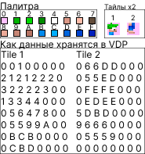
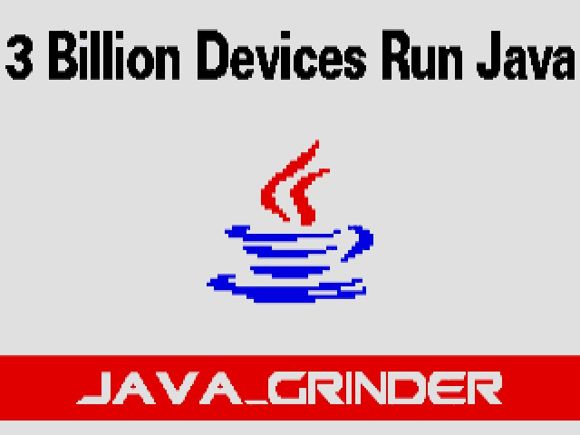
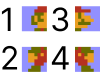
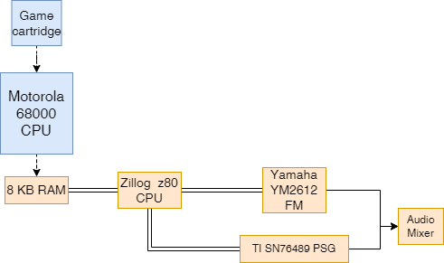

[Java для Sega Mega Drive --- возможно ли это?]{.c16 .c51}

[]{.c10 .c39}

[Введение]{.c16 .c19 .c14 .c40} {#h.h6gt414dh3ze .c2 .c24 .c54}
===============================

[]{.c10 .c39}

[В этом проекте я хотел ответить на вопрос: возможно ли написать игру на
Java для Sega Mega Drive/Genesis. Не хочу раскрывать спойлеры, но
ответом будет «да».]{.c47 .c24}

[Несколько лет назад я повстречал проект ]{.c24 .c47}[[Java
Grinder](https://www.google.com/url?q=http://www.mikekohn.net/micro/java_grinder.php&sa=D&source=editors&ust=1719326931811900&usg=AOvVaw15mb9kO6nV_l67pGFTlGc1){.c6}]{.c24
.c33}[, который позволяет писать код для различных ретро процессоров на
Java, в том числе для Sega Mega Drive. По сути, он интерпретирует
байт-код из файлов .class, полученных после компиляции, в код на
Ассемблере 68K. Если файлу класса нужны другие файлы классов, то они
тоже считываются и обрабатываются. Все вызовы методов API записываются в
выходном коде, либо как встроенный ассемблерный код, либо как вызовы
предварительно написанных функций, выполняющих свою задачу.]{.c47 .c24}

[Сама по себе система довольно проста, но мне ещё многому предстоит
научиться, а качественную информацию искать не так просто. На самом деле
в этом проекте я впервые занялся настоящим программированием для Mega
Drive.]{.c47 .c24}

[]{.c10 .c39}

[]{.c10 .c39}

[]{.c10 .c39}

[]{.c10 .c39}

[Содержание]{.c16 .c19 .c14 .c40} {#h.wcgoppftoo4v .c2 .c25}
=================================

1.  [[Подготовка](#h.pjth13kiikt6){.c6}]{.c17}
2.  [[Шрифт](#h.2p4ew7fx31fc){.c6}]{.c17}
3.  [[Графика](#h.g89va2xm96ut){.c6}]{.c17}

[3.1 ]{.c42}[[Палитра](#h.t6vmn49y60o6){.c6}]{.c17}

[3.2 ]{.c42}[[Задний фон](#h.365cp528md81){.c6}]{.c17}

[3.3 ]{.c42}[[Спрайты](#h.l8g6o8zbeeqw){.c6}]{.c17}

4.  [[Управление](#h.1khrmi2wrdtl){.c6}]{.c17}
5.  [[Звуки](#h.uxehfe2ww5tr){.c6}]{.c17}
6.  [[Вывод](#h.i3xlyh7eoj64){.c6}]{.c17}
7.  [[Демо](#h.x3jmzejorh4v){.c6}]{.c17}
8.  [[Ограничения](#h.ng3ipxylywyq){.c6}]{.c17}

[]{.c10 .c39}

[]{.c10 .c39}

[]{.c10 .c39}

1.  [Подготовка]{.c16 .c19 .c14 .c40} {#h.pjth13kiikt6 style="display:inline"}
    =================================

[Java Grinder изначально был сделан для линукса, и на данный момент нет
порта для windows, поэтому либо придётся использовать линукс, либо WSL.
Я использовал WSL, поэтому все дальнейшии примеры буду приводить на нем.
Чтобы начать создавать свои проекты необходимо выполнить несколько
шагов:]{.c0}

[]{.c10 .c50}

1.  [установите в ваш wsl утилиту make для сборки проектов и
    ]{.c0}[javac]{.c0}[(openjdk) для компиляции java
    файлов.]{.c0}[ ]{.c50}
2.  [клонируйте репозиторий ]{.c0}[[Java
    Grinder](https://www.google.com/url?q=https://github.com/mikeakohn/java_grinder&sa=D&source=editors&ust=1719326931814651&usg=AOvVaw0Ma5yXVAWC9yC6nR-wJhlH){.c6}]{.c37
    .c0}[, перейдите в папку репозитория и выполните команду wsl make. В
    результате должен создаться файл ]{.c0}[java\_grinder]{.c0}[.]{.c10
    .c0}
3.  [выполните команду make java для создания библиотеки классов
    ]{.c0}[JavaGrinder]{.c0}[.jar в папке build.]{.c10 .c0}
4.  [клонируйте репозиторий
    ]{.c0}[[naken\_asm](https://www.google.com/url?q=https://github.com/mikeakohn/naken_asm&sa=D&source=editors&ust=1719326931815130&usg=AOvVaw08t3wrCoeiDkhN_7szBaf2){.c6}]{.c37
    .c0 .c24}[, перейдите в папку репозитория и выполните команду
    ]{.c0}[./configure]{.c0 .c24}[, после этого выполните команду
    ]{.c0}[make. Созданный файл naked\_asm переместите в директорию Java
    Grinder. ]{.c0 .c24}
5.  [Создайте папку projects в директории]{.c0}[ Java Grinder или
    перейдите в папку samples и ]{.c0 .c24}[клонируйте туда репозиторий
    ]{.c0}[[Empty-project-Java-Grinder](https://www.google.com/url?q=https://github.com/Mark65537/Empty-project-Java-Grinder&sa=D&source=editors&ust=1719326931815567&usg=AOvVaw2cXjAV8iqUL19aYTQ8i0mn){.c6}]{.c37
    .c24 .c59}[. ]{.c0 .c24}[Это будет ваш шаблонный проект для создания
    ]{.c0}[программ и игр на Sega Mega Drive/Genesis. При создании новой
    игры просто скопируйте папку проекта и поменяйте название на
    название вашего проекта.]{.c10 .c0 .c24}

[Если у вас по какой-то причине не получается скомпилировать необходимые
файлы, вы можете воспользоваться моими заранее скомпилированными ]{.c0
.c24}[[файлами](https://www.google.com/url?q=https://github.com/Mark65537/Java-Grinder-Setup&sa=D&source=editors&ust=1719326931815835&usg=AOvVaw0IoWBWIWG8TbEJmPVQQo0e){.c6}]{.c37
.c0 .c24}[. ]{.c0 .c24}

[]{.c10 .c39}

2.  [Шрифт]{.c16 .c19 .c14 .c40} {#h.2p4ew7fx31fc style="display:inline"}
    ============================

[На данный момент в шрифте доступны только заглавные английские буквы.
]{.c10 .c0}

[Для вывода текста на экран нужно сначала использовать функцию для
установки начальных координат, где будет ]{.c0}[размещаться]{.c0 .c24
.c27}[ текст, ]{.c0}[SegaGenesis]{.c0}[.setCursor(int X, int Y), X
должен располагаться в диапазоне от 0 до 28, Y --- от 0 до
40.]{.c0}[ ]{.c0 .c67}[После этого можно использовать либо функцию
]{.c0}[SegaGenesis]{.c0}[.]{.c0}[printChar]{.c0}[(char c), которая
печатает один символ, либо ]{.c0}[SegaGenesis]{.c0}[.print(String text),
которая печатает текст целиком. Для удобства ]{.c0}[можете использовать
функции из класса ]{.c0
.c24}[[Text](https://www.google.com/url?q=https://github.com/Mark65537/Empty-project-Java-Grinder/blob/master/src/ConsoleHelper/Text.java&sa=D&source=editors&ust=1719326931816612&usg=AOvVaw2guWNUdViOpoRZtokPURNA){.c6}]{.c37
.c0 .c24}[.]{.c0 .c24}[ ]{.c0}[Будьте внимательны, функции print не
переносят текст на новую строку, если вы вышли за пределы экрана, вам
придется регулировать это самим.]{.c0 .c24}

[]{.c10 .c0}

[]{.c10 .c39}

3.  [ ГРАФИКА]{.c16 .c19 .c14 .c40} {#h.g89va2xm96ut style="display:inline"}
    ===============================

[Чтобы научиться выводить что-либо на экран, необходимо разобраться в
структуре графики на платформе Sega и в методах ]{.c0 .c24 .c27}[её]{.c0
.c24 .c27}[ кодирования. Подробнее об этом можно узнать в данной ]{.c0
.c24
.c27}[[статье](https://www.google.com/url?q=https://habr.com/ru/articles/471914/&sa=D&source=editors&ust=1719326931817145&usg=AOvVaw0XrhW5D2v0X6_WbS0vHuda){.c6}]{.c0
.c24 .c37}[.]{.c0 .c24}[ Вкратце, в Sega используется ]{.c0}[[тайловая
графика](https://www.google.com/url?q=https://ru.wikipedia.org/wiki/%25D0%25A2%25D0%25B0%25D0%25B9%25D0%25BB%25D0%25BE%25D0%25B2%25D0%25B0%25D1%258F_%25D0%25B3%25D1%2580%25D0%25B0%25D1%2584%25D0%25B8%25D0%25BA%25D0%25B0&sa=D&source=editors&ust=1719326931817398&usg=AOvVaw1o_qsZqonHCAcX4g9QnAKn){.c6}]{.c37
.c0}[, где каждый тайл имеет размер 8x8 пикселей и в памяти рома
занимает ]{.c0}[32 байта]{.c0 .c24}[. Для вывода изображения на экран
используется чип VDP(Video Display Processor). ]{.c10 .c0}

[Данные в VDP загружаются в определенном формате, который тесно связан с
палитрой. Суть этого кодирования заключается в присвоении каждому
пикселю тайла определенного индекса цвета из палитры, который может
варьироваться от 0 до 15(0x0-0xF).  Продемонстрируем ]{.c0}[данный ]{.c0
.c24}[ ]{.c24 .c27 .c65}[подход на примере персонажа ]{.c0 .c24
.c27}[[Lemming](https://www.google.com/url?q=https://www.spriters-resource.com/mobile/lemmingsreturn/sheet/53626/&sa=D&source=editors&ust=1719326931817786&usg=AOvVaw3-r66kjhlkV9Xpv4UgWMXY){.c6}]{.c37
.c0 .c24}[ из игры ]{.c0 .c24 .c27}[[Lemmings
Return](https://www.google.com/url?q=https://www.spriters-resource.com/mobile/lemmingsreturn/&sa=D&source=editors&ust=1719326931817986&usg=AOvVaw3obiT6a1-xMJgVy3KZ96EW){.c6}]{.c37
.c0 .c24}[ для Mobile. Этот персонаж является самым маленьким из мне
известных, который использует все 16 цветов палитры и полностью ]{.c0
.c24 .c27}[помеща]{.c0 .c24 .c27}[ется всего на два тайла. Если вы
знаете других таких же маленьких персонажей или меньше, напишите в
комментариях.]{.c0 .c24 .c27}

[Тайлы лемминга увеличенные вдвое + изображение палитры + демонстрация
как данные храниться в VDP:]{.c10 .c0}

[]{style="overflow: hidden; display: inline-block; margin: 0.00px 0.00px; border: 0.00px solid #000000; transform: rotate(0.00rad) translateZ(0px); -webkit-transform: rotate(0.00rad) translateZ(0px); width: 346.01px; height: 368.53px;"}

[3.1 ПАЛИТРА]{.c16 .c19 .c43 .c14} {#h.t6vmn49y60o6 .c2 .c25}
----------------------------------

[Давайте продолжим обсуждение графики и рассмотрим, как хранится палитра
в Java Grinder. Это важно для понимания работы других графических
элементов.]{.c0 .c24}

[В Sega Mega Drive используется 9 битная палитра.]{.c0}[ Подробнее об
этом можно прочитать
]{.c0}[[здесь](https://www.google.com/url?q=https://en.wikipedia.org/wiki/List_of_video_game_console_palettes%23Mega_Drive/Genesis_and_Pico&sa=D&source=editors&ust=1719326931818744&usg=AOvVaw0EEXpA-TNMLPAEQZ7pY64l){.c6}]{.c37
.c0}[ ]{.c0}[или ]{.c0
.c24}[[здесь](https://www.google.com/url?q=https://segaretro.org/Sega_Mega_Drive/Palettes_and_CRAM&sa=D&source=editors&ust=1719326931819003&usg=AOvVaw3GKMFUgQFJwgQiAQKCcTyQ){.c6}]{.c37
.c0 .c24}[. В]{.c0 .c24}[ памяти консоли один цвет палитры занимает 2
байта. Например значение белого цвета ]{.c0}[0хEEE]{.c0}[  будет
храниться как 0x0E, 0xEE.]{.c10 .c0}

[В Java Grinder палитра храниться в массиве ]{.c0}[short\[\] palette и
загружается с помощью API метода ]{.c0}[SegaGenesis]{.c0
.c15}[.setPaletteColorsAtIndex]{.c0 .c15}[(int index, short\[\] palette)
в VDP ]{.c0}[CRAM]{.c0}[ (\"Color RAM\" --- «цветовое
ОЗУ»)]{.c0}[.]{.c47 .c24}

[В массиве palette содержаться значения цветов 9 битной палитры в
16-ричном формате от 0x000 до ]{.c0}[0xEEE]{.c0}[. Максимальное
количество элементов в массиве не должно превышать 16. Если вы
используете меньше цветов, то рекомендуется неиспользуемые цвета
приравнять 0x000.]{.c0}

[Пример палитры лемминга из ]{.c0 .c24}[[предыдущего
раздела](#h.g89va2xm96ut){.c6}]{.c37 .c0 .c24}[:]{.c0 .c24}

[public]{.c13}[ ]{.c26}[static]{.c13}[ ]{.c26}[short]{.c38}[\[\]
]{.c26}[palette]{.c28}[ ]{.c26}[=]{.c8 .c16}

[  {   ]{.c26 .c16}

[    ]{.c26}[0xECE]{.c18}[, ]{.c26}[0x0A0]{.c18}[,
]{.c26}[0x0C0]{.c18}[, ]{.c26}[0x080]{.c18}[, ]{.c26}[0xEEE]{.c18}[,
]{.c26}[0x88C]{.c18}[, ]{.c26}[0xAAE]{.c18}[,
]{.c26}[0x246]{.c18}[,]{.c26 .c16}

[    ]{.c26}[0x8AE]{.c18}[, ]{.c26}[0x68C]{.c18}[,
]{.c26}[0x66A]{.c18}[, ]{.c26}[0xE80]{.c18}[, ]{.c26}[0xEA0]{.c18}[,
]{.c26}[0xC60]{.c18}[, ]{.c26}[0xC40]{.c18}[,
]{.c26}[0xA00]{.c18}[ ]{.c26 .c16}

[  };]{.c16 .c26}

[Значение палитры можно преобразовать из RGB в 9 битную по данному
алгоритму]{.c10 .c0}

[((color.B \>\> 5) \<\< 9) \| ((color.G \>\> 5) \<\< 5) \| ((color.R
\>\> 5) \<\< 1).]{.c10 .c0}

[К сожалению точное обратное преобразование получить почти
]{.c0}[невозможно, так как на одно значение приходиться 32 RGB
цвета]{.c0 .c24}[. Вы можете воспользоваться данным кодом для обратного
преобразования, но он не гарантирует, что вы получите такие же цвета,
как на эмуляторе или железе. ]{.c10 .c0}

[]{.c10 .c0}

[b = (color9bit \>\> 9) & 0x7;]{.c10 .c0}

[g = (color9bit \>\> 5) & 0x7;]{.c10 .c0}

[r = (color9bit \>\> 1) & 0x7;]{.c10 .c0}

[Color = (r \<\< 5, g \<\< 5, b \<\< 5);]{.c10 .c0}

[]{.c10 .c0}

[Если хотите точно конвертировать 9-битную палитру в RGB, вам необходимо
найти таблицу соответствий или вывести ее самому.]{.c0}

[]{.c10 .c0}

[3.2 Задний фон(background)]{.c16 .c19 .c14 .c43} {#h.365cp528md81 .c2 .c25}
-------------------------------------------------

[Для создания заднего фона и вывода его на экран нам потребуется 4
вещи:]{.c10 .c0}

1.  [массив palette ]{.c0}[из ]{.c0 .c24}[[предыдущего
    раздела.](#h.t6vmn49y60o6){.c6}]{.c37 .c0 .c24}
2.  [массив pattern]{.c10 .c0}

[В этом массиве хранятся отдельные части изображения --- тайлы. Они
записываются последовательно, сверху вниз и слева направо. Каждый
элемент массива представляет собой одну строку тайла.]{.c10 .c0}

3.  [массив images]{.c10 .c0}

[Это так называемая тайловая карта(tilemap) в которой последовательно
хранятся индексы тайлов из массива pattern.]{.c10 .c0}

4.  [API для загрузки данных в VDP:]{.c10 .c0}

-   [SegaGenesis]{.c0 .c14}[.]{.c0 .c14}[setPaletteColors]{.c0
    .c14}[(short\[\] palette):]{.c16 .c19 .c0 .c14}

[Загрузка палитры в VDP CRAM, начиная с индекса 0.]{.c0}

-   [SegaGenesis]{.c0 .c14}[.]{.c0 .c14}[setPatternTable]{.c0
    .c14}[(int\[\] pattern):]{.c16 .c19 .c0 .c14}

[Загрузка тайлов в VDP VRAM, начиная с индекса 0.]{.c10 .c0}

-   [SegaGenesis]{.c0 .c14}[.]{.c0 .c14}[setImageData]{.c0
    .c14}[(int\[\] image);]{.c16 .c19 .c0 .c14}

[Загрузка тайловой карты в конец VDP]{.c10 .c0}

[]{.c10 .c0}

[Пример
]{.c0}[[кода](https://www.google.com/url?q=https://github.com/Mark65537/Empty-project-Java-Grinder/blob/master/res/images/ImgJavaGrinder.java&sa=D&source=editors&ust=1719326931823189&usg=AOvVaw1qZl4aIGPgVFWo0VhFmpf9){.c6}]{.c37
.c0}[ класса заднего фона, который содержит данное изображение:]{.c0}

[]{style="overflow: hidden; display: inline-block; margin: 0.00px 0.00px; border: 0.00px solid #000000; transform: rotate(0.00rad) translateZ(0px); -webkit-transform: rotate(0.00rad) translateZ(0px); width: 603.21px; height: 452.00px;"}

[]{.c10 .c43}

3.3 Спрайты {#h.l8g6o8zbeeqw .c2 .c25}
-----------

[Спрайты создаются очень похоже на задний фон, но для их отрисовки
требуется больше вызовов API. Кроме того, спрайты не содержат тайловую
карту, то есть они не оптимизированы, в отличие от заднего фона. Это
означает, что одни и те же тайлы спрайтов могут встречаться несколько
раз в VDP. На самом деле это можно оптимизировать, но данная тема
выходит за рамки данной статьи, об этом можете почитать
]{.c0}[[здесь](https://www.google.com/url?q=https://under-prog.ru/sgdk-optimiziruem-sprajty/&sa=D&source=editors&ust=1719326931823877&usg=AOvVaw0KvgMTqhkPFL9kOk7KdE4J){.c6}]{.c37
.c0}[.]{.c10 .c0}

[Спрайты отрисовываются в виртуальном пространстве 512x512 пикселей, где
координаты (128,128) совпадают с верхним левым углом телеэкрана.]{.c0
.c24 .c64}

[Внутри консоли спрайты рендерятся в обратном порядке, т.е. сверху вниз,
слева направо.]{.c10 .c0}

[Пример:]{.c10 .c0}

[]{style="overflow: hidden; display: inline-block; margin: 0.00px 0.00px; border: 0.00px solid #000000; transform: rotate(0.00rad) translateZ(0px); -webkit-transform: rotate(0.00rad) translateZ(0px); width: 200.00px; height: 150.00px;"}

[Для вывода спрайта на экран нам нужно использовать функции API:]{.c10
.c0}

-   [SegaGenesis]{.c0 .c15}[.]{.c0 .c15}[setPaletteColorsAtIndex]{.c0
    .c15}[(int index, short\[\] palette)]{.c10 .c0}

[функция работает аналогично функции
]{.c0}[SegaGenesis]{.c0}[.]{.c0}[setPaletteColors]{.c0}[(short\[\]
palette), которая используется для загрузки палитры заднего фона,
единственное отличие в том что можно задать индекс начала загрузки
палитры. Значение индекса должно быть от 0 до 63, если передать индекс
за пределы диапазона, то это может привести к непредвиденным
последствиям.]{.c10 .c0}

-   [SegaGenesis]{.c0 .c15}[.]{.c0 .c15}[setPatternTableAtIndex]{.c0
    .c15}[(int index, int\[\] patterns);]{.c10 .c0}

[Функция работает аналогично функции
]{.c0}[SegaGenesis]{.c0}[.]{.c0}[setPatternTable]{.c0}[(int\[\]
pattern). Параметр index определяет адрес, с которого начинается
загрузка тайлов в видеопамять(VDP). Не рекомендуется записывать в
диапазон \[0x0460, 0x0479\], так как в эти адреса загружается
шрифт.]{.c10 .c0}

-   [SegaGenesis]{.c0 .c15}[.]{.c0 .c15}[setSpritePosition]{.c0
    .c15}[(int index, int x, int y);]{.c10 .c0}

[Функция настраивает позицию спрайта по индексу спрайта из ]{.c0}[Sprite
Attribute Table]{.c0 .c24}[, не путать с индексом из функции
]{.c0}[setPatternTableAtIndex]{.c0 .c15}[. Чтобы спрайт отобразился на
экране, значения x и y должны быть в диапазоне x=(128, 448) y=(128,
352). ]{.c10 .c0}

-   [SegaGenesis.setSpriteConfig1]{.c0 .c15}[(int index, int
    value);]{.c10 .c0}

[это так называемое первое слово конфигурации спрайта, в которое входит:
горизонтальный размер спрайта в тайлах, вертикальный  размер спрайта в
тайлах, индекс следующего спрайта который нужно отобразить]{.c0}[.]{.c0}

-   [SegaGenesis.setSpriteConfig2]{.c0 .c15}[(int index, int
    value);]{.c10 .c0}

[Второе слово в которое входит: номер палитры, отображение по
горизонтали или вертикали(опционально), адрес спрайта в VDP.]{.c10 .c0}

[]{.c10 .c0}

[Пример
]{.c0}[[кода](https://www.google.com/url?q=https://github.com/Mark65537/Empty-project-Java-Grinder/blob/master/res/sprites/SprArrow.java&sa=D&source=editors&ust=1719326931825895&usg=AOvVaw2lyOnJNN-ah8zza6qH4HhF){.c6}]{.c37
.c0}[ спрайта компьютерной мыши.]{.c10 .c0}

[]{.c10 .c0}

4.  [Управление]{.c16 .c19 .c14 .c40} {#h.1khrmi2wrdtl style="display:inline"}
    =================================

[На данный момент реализовано только 3 кнопочное управление, без кнопки
Mode. В API содержится метод для получения кода текущей нажатой
кнопки(getJoypadValuePort1), и константы кодов кнопок.]{.c10 .c0}

[public static final int JOYPAD\_START = 0x2000;]{.c10 .c0}

[public static final int JOYPAD\_A = 0x1000;]{.c0 .c10}

[public static final int JOYPAD\_C = 0x0020;]{.c10 .c0}

[public static final int JOYPAD\_B = 0x0010;]{.c10 .c0}

[public static final int JOYPAD\_RIGHT = 0x0008;]{.c10 .c0}

[public static final int JOYPAD\_LEFT = 0x0004;]{.c10 .c0}

[public static final int JOYPAD\_DOWN = 0x0002;]{.c10 .c0}

[public static final int JOYPAD\_UP = 0x0001;]{.c10 .c0}

[Но ]{.c0}[если вы попробуете написать что то подобное, то это не будет
работать]{.c0 .c24}[:]{.c10 .c0}

[        int
keyCode=]{.c0}[SegaGenesis]{.c0}[.getJoypadValuePort1();]{.c10 .c0}

[        if (keyCode == JOYPAD\_A){]{.c10 .c0}

[                //Действия для кнопки А]{.c10 .c0}

[}]{.c10 .c0}

[На данный момент неизвестно, как автор планировал работу с джойстиком,
поскольку в единственном демонстрационном примере для Sega отсутствует
реализация работы с ним.]{.c10 .c0}

[Экспериментальным путем удалось определить истинные значения констант
(если кто-то знает, почему используются именно эти значения, просьба
написать в комментариях). Также выяснилось, что значения для каждой
клавиши могут меняться со временем в диапазоне от 0x0000 до 0xF000 с
шагом 0x0100. Кроме того, было установлено, что тип значений кнопок A и
START ---]{.c0}[ int]{.c0}[(возможно short, но функция
getJoypadValuePort1 возвращает int), а для остальных кнопок --- byte.
Это говорит о том, что значения кнопок могут изменяться и не являются
константами.]{.c0}[ Учитывая данные особенности, для реализации
управления можно использовать два метода:]{.c10 .c0 .c24}

[Примечание: в данном коде не реализовано ]{.c0 .c24
.c57}[многокнопочное]{.c0 .c24 .c57}[ управление. Это означает, что за
раз можно нажать только одну кнопку, и пока вы не отпустите предыдущую,
следующую не будет прочитана.]{.c19 .c0 .c24 .c46}

[1 метод. Использовать цикл для распознавания, текущей нажатой клавиши.
За счет цикла данный метод работает медленнее, но из-за этого в нем
плавнее движение спрайта.]{.c10 .c0 .c24}

[int]{.c38}[ ]{.c28}[keyCode]{.c28}[ ]{.c26}[=]{.c8}[ ]{.c26}[SegaGenesis]{.c28}[.]{.c26}[getJoypadValuePort1]{.c36}[();]{.c26}[ 
    ]{.c34 .c16}

[//проверка нажатий кнопок]{.c34 .c16}

[      ]{.c8}[if]{.c30}[(!]{.c8}[pressed]{.c28}[){]{.c8 .c16}

[        ]{.c8}[for]{.c30}[ (]{.c8}[int]{.c38}[ ]{.c8}[i]{.c28}[ =
]{.c8}[0x0000]{.c18}[; ]{.c8}[i]{.c28}[ \<= ]{.c8}[0xF000]{.c18}[;
]{.c8}[i]{.c28}[+=]{.c8}[0x0100]{.c18}[) {]{.c8 .c16}

[              ]{.c8}[// проверка нажатия кнопки вверх]{.c16 .c34}

[              ]{.c8}[if]{.c30}[(]{.c8}[keyCode]{.c28}[ ==
(]{.c8}[i]{.c28}[+]{.c8}[0x0081]{.c18}[) && ]{.c8}[y]{.c28}[ \>
]{.c8}[0x7F]{.c18}[) {                      ]{.c8 .c16}

[                ]{.c8 .c16}

[                ]{.c8}[break]{.c30}[;]{.c8 .c16}

[              }]{.c8 .c16}

[             ]{.c8 .c16}

[              ]{.c8}[// проверка нажатия кнопки вниз            ]{.c34
.c16}

[              ]{.c8}[if]{.c30}[(]{.c8}[keyCode]{.c28}[ ==
(]{.c8}[i]{.c28}[+]{.c8}[0x0082]{.c18}[) && ]{.c8}[y]{.c28}[ \<
]{.c8}[0x160]{.c18}[) {                      ]{.c8 .c16}

[                ]{.c8 .c16}

[                ]{.c8}[break]{.c30}[;]{.c8 .c16}

[              }]{.c8 .c16}

[             ]{.c8 .c16}

[              ]{.c8}[// проверка нажатия кнопки влево                  
 ]{.c34 .c16}

[              ]{.c8}[if]{.c30}[(]{.c8}[keyCode]{.c28}[ ==
(]{.c8}[i]{.c28}[+]{.c8}[0x0084]{.c18}[) && ]{.c8}[x]{.c28}[ \>
]{.c8}[0x7E]{.c18}[) {                      ]{.c8 .c16}

[                ]{.c8 .c16}

[                ]{.c8}[break]{.c30}[;                ]{.c8 .c16}

[              }]{.c8 .c16}

[]{.c8 .c16}

[              ]{.c8}[// проверка нажатия кнопки вправо          ]{.c34
.c16}

[              ]{.c8}[if]{.c30}[(]{.c8}[keyCode]{.c28}[ ==
(]{.c8}[i]{.c28}[+]{.c8}[0x0088]{.c18}[) && ]{.c8}[x]{.c28}[ \<
]{.c8}[0x1C0]{.c18}[) {                      ]{.c8 .c16}

[                ]{.c8 .c16}

[                ]{.c8}[break]{.c30}[;]{.c8 .c16}

[              }]{.c8 .c16}

[]{.c8 .c16}

[              ]{.c8}[// проверка нажатия кнопки A        ]{.c34 .c16}

[              ]{.c8}[if]{.c30}[(]{.c8}[keyCode]{.c28}[ ==
(]{.c8}[i]{.c28}[+]{.c8}[0xD080]{.c18}[)) {]{.c8 .c16}

[]{.c8 .c16}

[                ]{.c8}[pressed]{.c28}[ = ]{.c8}[true]{.c13}[;]{.c8
.c16}

[                ]{.c8}[break]{.c30}[;]{.c8 .c16}

[              }]{.c8 .c16}

[]{.c8 .c16}

[              ]{.c8}[// проверка нажатия кнопки B          ]{.c34 .c16}

[              ]{.c8}[if]{.c30}[(]{.c8}[keyCode]{.c28}[ ==
(]{.c8}[i]{.c28}[+]{.c8}[0x0090]{.c18}[)) {                ]{.c8 .c16}

[                         ]{.c8 .c16}

[                ]{.c8}[pressed]{.c28}[ = ]{.c8}[true]{.c13}[;]{.c8
.c16}

[                ]{.c8}[break]{.c30}[;]{.c8 .c16}

[              }]{.c8 .c16}

[]{.c8 .c16}

[              ]{.c8}[// проверка нажатия кнопки C          ]{.c34 .c16}

[              ]{.c8}[if]{.c30}[(]{.c8}[keyCode]{.c28}[ ==
(]{.c8}[i]{.c28}[+]{.c8}[0x00A0]{.c18}[)) {                      ]{.c8
.c16}

[]{.c8 .c16}

[                ]{.c8}[pressed]{.c28}[ = ]{.c8}[true]{.c13}[;]{.c8
.c16}

[                ]{.c8}[break]{.c30}[;]{.c8 .c16}

[              }]{.c8 .c16}

[]{.c8 .c16}

[              ]{.c8}[// проверка нажатия кнопки START          ]{.c34
.c16}

[              ]{.c8}[if]{.c30}[(]{.c8}[keyCode]{.c28}[ ==
(]{.c8}[i]{.c28}[+]{.c8}[0xE080]{.c18}[)) {]{.c8 .c16}

[                ]{.c8 .c16}

[                ]{.c8}[pressed]{.c28}[ = ]{.c8}[true]{.c13}[;]{.c8
.c16}

[                ]{.c8}[break]{.c30}[;]{.c8 .c16}

[              }]{.c8 .c16}

[        }          ]{.c8 .c16}

[      }]{.c8 .c16}

[      ]{.c8}[else]{.c30}[ ]{.c8}[if]{.c30}[(]{.c8}[keyCode]{.c28}[ ==
]{.c8}[0xCC80]{.c18}[ \|\| ]{.c8}[keyCode]{.c28}[ ==
]{.c8}[0xC080]{.c18}[) {]{.c8 .c16}

[        ]{.c8}[pressed]{.c28}[ = ]{.c8}[false]{.c13}[;]{.c8 .c16}

[      }]{.c8}

[]{.c16 .c24 .c53}

[2 метод. В данном методе спрайт может перемещаться с максимальной
скоростью, из-за чего его может быть не видно и нужно делать задержку,
используя функцию ]{.c0 .c24}[Timer]{.c0 .c24}[.]{.c0 .c24}[wait]{.c0
.c24}[(int frames) или условия задержки по счетчику.]{.c0 .c24}

[int]{.c38 .c9}[ ]{.c3}[keyCode]{.c28 .c9}[ ]{.c3}[=]{.c8
.c9}[ ]{.c3}[SegaGenesis]{.c38 .c9}[.]{.c3}[getJoypadValuePort1]{.c36
.c9}[();]{.c1}

[     ]{.c1}

[      ]{.c3}[//проверка нажатий кнопок]{.c34 .c16 .c9}

[      ]{.c3}[if]{.c30 .c9}[(]{.c3}[!]{.c8 .c9}[pressed]{.c28
.c9}[){]{.c1}

[        ]{.c3}[// проверка нажатия кнопки вверх 0x81]{.c34 .c16 .c9}

[        ]{.c3}[if]{.c30 .c9}[((]{.c3}[byte]{.c38
.c9}[)]{.c3}[keyCode]{.c9 .c28}[ ]{.c3}[==]{.c8 .c9}[ ]{.c3}[-]{.c8
.c9}[127]{.c18 .c9}[ ]{.c3}[&&]{.c8 .c9}[ ]{.c3}[y]{.c28
.c9}[ ]{.c3}[\>]{.c8 .c9}[ ]{.c3}[0x7F]{.c18 .c9}[) {                  
   ]{.c1}

[]{.c1}

[          ]{.c3}[Timer]{.c38 .c9}[.]{.c3}[wait]{.c9
.c36}[(]{.c3}[1]{.c18 .c9}[);]{.c1}

[        }]{.c1}

[]{.c1}

[        ]{.c3}[// проверка нажатия кнопки вниз 0x82            ]{.c34
.c16 .c9}

[        ]{.c3}[if]{.c30 .c9}[((]{.c3}[byte]{.c38
.c9}[)]{.c3}[keyCode]{.c28 .c9}[ ]{.c3}[==]{.c8 .c9}[ ]{.c3}[-]{.c8
.c9}[126]{.c18 .c9}[ ]{.c3}[&&]{.c8 .c9}[ ]{.c3}[y]{.c28
.c9}[ ]{.c3}[\<]{.c8 .c9}[ ]{.c3}[0x160]{.c18 .c9}[) {                  
   ]{.c1}

[]{.c1}

[          ]{.c3}[Timer]{.c38 .c9}[.]{.c3}[wait]{.c36
.c9}[(]{.c3}[1]{.c18 .c9}[);]{.c1}

[        }]{.c1}

[             ]{.c1}

[        ]{.c3}[// проверка нажатия кнопки влево 0x84                
 ]{.c34 .c16 .c9}

[        ]{.c3}[if]{.c30 .c9}[((]{.c3}[byte]{.c9
.c38}[)]{.c3}[keyCode]{.c28 .c9}[ ]{.c3}[==]{.c8 .c9}[ ]{.c3}[-]{.c8
.c9}[124]{.c18 .c9}[ ]{.c3}[&&]{.c8 .c9}[ ]{.c3}[x]{.c28
.c9}[ ]{.c3}[\>]{.c8 .c9}[ ]{.c3}[0x7E]{.c18 .c9}[) {                  
   ]{.c1}

[]{.c1}

[          ]{.c3}[Timer]{.c38 .c9}[.]{.c3}[wait]{.c36
.c9}[(]{.c3}[1]{.c18 .c9}[);                ]{.c1}

[        }]{.c1}

[]{.c1}

[        ]{.c3}[// проверка нажатия кнопки вправо 0x88        ]{.c34
.c16 .c9}

[        ]{.c3}[if]{.c30 .c9}[((]{.c3}[byte]{.c38
.c9}[)]{.c3}[keyCode]{.c28 .c9}[ ]{.c3}[==]{.c8 .c9}[ ]{.c3}[-]{.c8
.c9}[120]{.c18 .c9}[ ]{.c3}[&&]{.c8 .c9}[ ]{.c3}[x]{.c28
.c9}[ ]{.c3}[\<]{.c8 .c9}[ ]{.c3}[0x1C0]{.c18 .c9}[) {                  
   ]{.c1}

[]{.c1}

[          ]{.c3}[Timer]{.c38 .c9}[.]{.c3}[wait]{.c36
.c9}[(]{.c3}[1]{.c18 .c9}[);]{.c1}

[        }]{.c1}

[]{.c1}

[        ]{.c3}[// проверка нажатия кнопки A 0xD080        ]{.c34 .c16
.c9}

[        ]{.c3}[if]{.c30 .c9}[(]{.c3}[keyCode]{.c28 .c9}[ ]{.c3}[==]{.c8
.c9}[ ]{.c3}[0xD080]{.c18 .c9}[) {]{.c1}

[]{.c1}

[          ]{.c3}[pressed]{.c28 .c9}[ ]{.c3}[=]{.c8
.c9}[ ]{.c3}[true]{.c13 .c9}[;]{.c1}

[        }]{.c1}

[]{.c1}

[        ]{.c3}[// проверка нажатия кнопки B 0x90        ]{.c34 .c16
.c9}

[        ]{.c3}[if]{.c30 .c9}[((]{.c3}[byte]{.c38
.c9}[)]{.c3}[keyCode]{.c28 .c9}[ ]{.c3}[==]{.c8 .c9}[ ]{.c3}[-]{.c8
.c9}[112]{.c18 .c9}[) {]{.c1}

[                   ]{.c1}

[          ]{.c3}[pressed]{.c28 .c9}[ ]{.c3}[=]{.c8
.c9}[ ]{.c3}[true]{.c13 .c9}[;]{.c1}

[        }]{.c1}

[]{.c1}

[        ]{.c3}[// // проверка нажатия кнопки C 0xA0        ]{.c34 .c16
.c9}

[        ]{.c3}[if]{.c30 .c9}[((]{.c3}[byte]{.c38
.c9}[)]{.c3}[keyCode]{.c28 .c9}[ ]{.c3}[==]{.c8 .c9}[ ]{.c3}[-]{.c8
.c9}[96]{.c18 .c9}[) {                      ]{.c1}

[          ]{.c1}

[          ]{.c3}[pressed]{.c28 .c9}[ ]{.c3}[=]{.c8
.c9}[ ]{.c3}[true]{.c13 .c9}[;]{.c1}

[        }]{.c1}

[]{.c1}

[        ]{.c3}[// проверка нажатия кнопки START 0xE080        ]{.c34
.c16 .c9}

[        ]{.c3}[if]{.c30 .c9}[(]{.c3}[keyCode]{.c28 .c9}[ ]{.c3}[==]{.c8
.c9}[ ]{.c3}[0xE080]{.c18 .c9}[) {]{.c1}

[          ]{.c1}

[          ]{.c3}[pressed]{.c28 .c9}[ ]{.c3}[=]{.c8
.c9}[ ]{.c3}[true]{.c13 .c9}[;]{.c1}

[        }]{.c1}

[      }]{.c1}

[      ]{.c3}[else]{.c30 .c9}[ ]{.c3}[if]{.c30
.c9}[(]{.c3}[keyCode]{.c28 .c9}[ ]{.c3}[==]{.c8
.c9}[ ]{.c3}[0xCC80]{.c18 .c9}[ ]{.c3}[\|\|]{.c8
.c9}[ ]{.c3}[keyCode]{.c28 .c9}[ ]{.c3}[==]{.c8
.c9}[ ]{.c3}[0xC080]{.c18 .c9}[) {]{.c1}

[        ]{.c3}[pressed]{.c28 .c9}[ ]{.c3}[=]{.c8
.c9}[ ]{.c3}[false]{.c13 .c9}[;          ]{.c1}

[      }]{.c3}

[]{.c10 .c0}

5.  [Звуки]{.c16 .c19 .c14 .c40} {#h.uxehfe2ww5tr style="display:inline"}
    ============================

[]{.c10 .c39}

[Для того чтобы проиграть хоть какую-нибудь мелодию на Sega Mega Drive,
необходимо знать как работает звук на платформе. ]{.c0 .c24
.c27}[Вкратце, для воспроизведения звука на Sega используется: z80 CPU,
z80 RAM, Yamaha 2612, PSG, Audio Mixer. Мы можем напрямую
взаимодействовать только с z80 RAM, а он уже непосредственно будет
управлять всем остальным. Примерная схема взаимодействия выглядит
так:]{.c10 .c0}

[]{style="overflow: hidden; display: inline-block; margin: 0.00px 0.00px; border: 0.00px solid #000000; transform: rotate(0.00rad) translateZ(0px); -webkit-transform: rotate(0.00rad) translateZ(0px); width: 491.00px; height: 291.00px;"}

[]{.c10 .c0}

[Начнем с подготовки файлов музыки и звуков. Музыкальный файл должен
быть монофоническим, с глубиной звука 8 бит и, желательно, с частотой
дискретизации 44100 Гц. ]{.c0}[Рекомендуется использовать файлы с
расширением .wav, поскольку у данного формата вся необходимая информация
содержится в заголовке, а данные хранятся в исходном(RAW) формате]{.c0
.c24}[.]{.c0 .c24}^[\[a\]](#cmnt1){#cmnt_ref1}^

[Для работы с z80 используются API методы: ]{.c0}

-   [loadZ80]{.c0 .c14}[(byte\[\] code)]{.c0 .c14}[: Загружает код
    размером до 8 килобайт в Z80 RAM. Z80 будет сброшен через API, и
    загруженный код начнет выполняться.]{.c10 .c0}
-   [resetZ80()]{.c0 .c14}[: Сбрасывает состояние Z80, возвращая его к
    начальному состоянию.]{.c10 .c0}
-   [pauseZ80]{.c0 .c14}[()]{.c0 .c14}[: Приостанавливает выполнение
    Z80. Это необходимо для того, чтобы главный процессор m68000 мог
    получить доступ к каким-либо ресурсам в пространстве Z80.]{.c10 .c0}
-   [startZ80()]{.c0 .c14}[: Запускает выполнение Z80 снова, после того
    как он был приостановлен или остановлен.]{.c10 .c0}

[]{.c10 .c0}

[Есть 3 способа как проиграть мелодию: загрузить звук в z80 RAM плюс код
инициализации, загрузить ноты и их последовательность в z80 RAM плюс код
инициализации, загрузить данные из wav файла в ром и wav проигрыватель в
z80 RAM и передать адрес начала в определенное смещение в z80 RAM.
Разберем каждый способ по порядку]{.c10 .c0}

[]{.c10 .c0}

[Способ 1. Загрузить звук с кодом инициализации в z80 RAM.]{.c16 .c19
.c14 .c42}

[Для начала нам понадобиться код инициализации. Код инициализации это
код на ассемблере z80, Который передается через процессор M68000 в z80
RAM как ]{.c0}[скомпилированный массив данных]{.c0 .c24}[.]{.c0}[ Чтобы
его получить вы можете скомпилировать файл
]{.c0}[[z80\_play\_dac.asm](https://www.google.com/url?q=https://github.com/mikeakohn/java_grinder/blob/master/samples/sega_genesis/z80_play_dac.asm&sa=D&source=editors&ust=1719326931843934&usg=AOvVaw1Gc3B4mUhjTrOAZcpBqovM){.c6}]{.c37
.c0 .c24}[ с помощью ]{.c0}[naked\_asm]{.c0}[, перевести его в java байт
массив и выделить из него код инициализации, или можете использовать
готовый массив кода инициализации]{.c0}[:]{.c10 .c0 .c24}

[  ]{.c3}[static]{.c13 .c9}[ ]{.c3}[byte]{.c38
.c9}[ ]{.c3}[loopDelay]{.c28 .c9}[ ]{.c3}[=]{.c8 .c9}[ ]{.c3}[62]{.c18
.c9}[;]{.c3}[//задержка. сколько раз будет выполнен цикл]{.c34 .c9}

[public]{.c13 .c9}[ ]{.c3}[static]{.c13 .c9}[ ]{.c3}[byte]{.c38
.c9}[\[\] ]{.c3}[z80\_init\_code]{.c28 .c9}[ ]{.c3}[=]{.c8 .c16 .c9}

[  {]{.c1}

[      ]{.c3}[62]{.c18 .c9}[,   ]{.c3}[43]{.c18 .c9}[,   ]{.c3}[50]{.c18
.c9}[,    ]{.c3}[0]{.c18 .c9}[,   ]{.c3}[64]{.c18 .c9}[,  
]{.c3}[62]{.c18 .c9}[, ]{.c3}[-]{.c8 .c9}[128]{.c18 .c9}[,  
]{.c3}[50]{.c18 .c9}[,]{.c1}

[       ]{.c3}[1]{.c18 .c9}[,   ]{.c3}[64]{.c18 .c9}[,  ]{.c3}[-]{.c8
.c9}[35]{.c18 .c9}[,   ]{.c3}[33]{.c18 .c9}[,   ]{.c3}[58]{.c18 .c9}[,  
 ]{.c3}[0]{.c18 .c9}[,   ]{.c3}[33]{.c18 .c9}[,  ]{.c3}[112]{.c18
.c9}[,]{.c1}

[      ]{.c3}[23]{.c18 .c9}[,   ]{.c3}[62]{.c18 .c9}[,   ]{.c3}[42]{.c18
.c9}[,   ]{.c3}[50]{.c18 .c9}[,    ]{.c3}[0]{.c18 .c9}[,  
]{.c3}[64]{.c18 .c9}[,  ]{.c3}[-]{.c8 .c9}[35]{.c18 .c9}[,
 ]{.c3}[126]{.c18 .c9}[,]{.c1}

[       ]{.c3}[0]{.c18 .c9}[,   ]{.c3}[50]{.c9 .c18}[,    ]{.c3}[1]{.c18
.c9}[,   ]{.c3}[64]{.c18 .c9}[,  ]{.c3}[-]{.c8 .c9}[35]{.c18 .c9}[,  
]{.c3}[35]{.c18 .c9}[,    ]{.c3}[6]{.c18 .c9}[,   ]{.c3}[loopDelay]{.c28
.c9}[,]{.c1}

[      ]{.c3}[16]{.c18 .c9}[,   ]{.c3}[-]{.c8 .c9}[2]{.c18 .c9}[,  
]{.c3}[43]{.c18 .c9}[,  ]{.c3}[125]{.c18 .c9}[,   ]{.c3}[-]{.c8
.c9}[2]{.c18 .c9}[,    ]{.c3}[0]{.c18 .c9}[,   ]{.c3}[32]{.c18 .c9}[,
 ]{.c3}[-]{.c8 .c9}[23]{.c18 .c9}[,]{.c1}

[     ]{.c3}[124]{.c18 .c9}[,   ]{.c3}[-]{.c8 .c9}[2]{.c18 .c9}[,  
 ]{.c3}[0]{.c18 .c9}[,   ]{.c3}[32]{.c18 .c9}[,  ]{.c3}[-]{.c8
.c9}[28]{.c18 .c9}[,   ]{.c3}[62]{.c18 .c9}[,   ]{.c3}[43]{.c18 .c9}[,  
]{.c3}[50]{.c18 .c9}[,]{.c1}

[       ]{.c3}[0]{.c18 .c9}[,   ]{.c3}[64]{.c18 .c9}[,   ]{.c3}[62]{.c18
.c9}[,    ]{.c3}[0]{.c18 .c9}[,   ]{.c3}[50]{.c18 .c9}[,  
 ]{.c3}[1]{.c18 .c9}[,   ]{.c3}[64]{.c18 .c9}[,  ]{.c3}[-]{.c8
.c9}[61]{.c18 .c9}[,]{.c1}

[      ]{.c3}[55]{.c18 .c9}[,    ]{.c3}[0]{.c18 .c9}[,]{.c1}

[}]{.c3}

[После вставки кода инициализации в z80 RAM свободного места у вас
остается 512-58=454 байт, этого обычно достаточно для небольшого
звукового эффекта, но не для проигрывания полной мелодии.]{.c10 .c0}

[]{.c10 .c0}

[Способ 2. Записать ноты или мелодии и проигрывать их по заданному
сценарию]{.c16 .c19 .c42 .c14}

[Автор Java Grinder для реализации данного способа, использовал гитарные
аккорды и ]{.c0}[проигрывал их в цикле по заданному порядку]{.c0}[.
Можете модифицировать данный
]{.c0}[[код](https://www.google.com/url?q=https://github.com/mikeakohn/java_grinder/blob/master/samples/sega_genesis/z80_play_title_song.asm&sa=D&source=editors&ust=1719326931848708&usg=AOvVaw2pU2NTFZkAFxcSMBEi5HgQ){.c6}]{.c37
.c0}[ для создания своей собственной мелодии, после чего скомпилировать
его с помощью naked\_asm и перевести в java байт массив. ]{.c10 .c0}

[]{.c10 .c0}

[Способ 3. Написать свой проигрыватель или использовать уже готовый.
]{.c16 .c19 .c42 .c14}

[Для этого метода нужно: разместить код проигрывателя в z80 RAM,
разместить музыкальные данные в ROM, определить адрес и длину
музыкальных данных в ROM, ]{.c0}[записать адрес и длину в определенное
место в z80 RAM]{.c0}[.]{.c10 .c0}

[К сожалению тут мы сталкиваемся с одним из ограничений Java, ]{.c0
.c24}[максимальный размер статического массива не должен превышать 8 242
элементов. Мы можем ]{.c0}[преодолеть ]{.c0 .c24}[данное ограничение
использовав вместо типа byte тип int(самый большой тип данных в Grinder
на данный момент), тогда получаем что максимальный размер файла который
можно загрузить в один массив равно 8 242 \* 4 = 32968 байт или почти 33
Килобайт. Именно такой длины музыкальный файл мы можем загрузить без
проблем в ROM, для его загрузки в память ROM, мы должны просто сослаться
на него, например: byte\[\] b = z80\_code или создать пустую функцию в
файле, где у вас расположен массив ]{.c0}[z80\_code]{.c0}[ и просто
вызвать ее, например: public static void init(){}. Если этого размера
вам недостаточно, то придется создавать несколько массивов и вызывать их
все по очереди в функции обертке. К сожалению, запись музыки в ROM один
в один не получится, так как между массивами будет вставлено 4 байта,
указывающие на размер массива.]{.c10 .c0}

[На данный момент нет примера пользовательского проигрывателя
wav-файлов, а также нет мелодии, которую можно было бы воспроизвести с
его помощью. ]{.c10 .c0}

[]{.c10 .c0}

6.  [Вывод]{.c16 .c19 .c14 .c40} {#h.i3xlyh7eoj64 style="display:inline"}
    ============================

[На текущий момент движок очень сырой и лучше всего подойдет для
создания каких-нибудь живых книг или визуальных новелл, желательно без
музыки или очень короткой, так как на нем очень просто отображать задний
фон. Для более сложных проектов, таких как платформеры, лучше
использовать другие движки, например
]{.c0}[[SGDK](https://www.google.com/url?q=https://github.com/Stephane-D/SGDK&sa=D&source=editors&ust=1719326931849988&usg=AOvVaw36e_iGrBwWgCTcD1oTmtMc){.c6}]{.c37
.c0}[ или
]{.c0}[[BasieGaxorz(BEX)](https://www.google.com/url?q=https://devster.monkeeh.com/sega/basiegaxorz/&sa=D&source=editors&ust=1719326931850165&usg=AOvVaw2kR5YIXFIn4qFn6KdPnB2N){.c6}]{.c37
.c0}[. Более полный список всех собранных движков можно посмотреть
]{.c0}[[здесь](https://www.google.com/url?q=https://github.com/And-0/awesome-megadrive&sa=D&source=editors&ust=1719326931850333&usg=AOvVaw33J5EE_UGs1vkC0QyR4m0U){.c6}]{.c37
.c0}[.]{.c10 .c0}

[]{.c10 .c0}

7.  [Демо]{.c16 .c19 .c14 .c40} {#h.x3jmzejorh4v style="display:inline"}
    ===========================

[На данный момент существует всего два проекта для Sega Mega Drive
сделанных на Java Grinder. ]{.c10 .c0}

1.  [ ]{.c0
    .c24}[[sega\_genesis\_java\_demo.bin](https://www.google.com/url?q=https://www.mikekohn.net/micro/binaries/sega_genesis_java_demo.bin&sa=D&source=editors&ust=1719326931850808&usg=AOvVaw0iEHerJt7tYt42HtAHOrlO){.c6}]{.c37
    .c0 .c24}[ - это демо версия от разработчика для демонстрации
    возможности движка]{.c10 .c0}
2.  [[Dr. Sukebe
    x-boobs](https://www.google.com/url?q=https://romhacking.ru/news/dr_sukebe_x_boobs_smd/2024-01-14-11750&sa=D&source=editors&ust=1719326931851097&usg=AOvVaw0NKTJrvC5Ph5zdMawFmOLh){.c6}]{.c37
    .c0}[ - это эротически-юморная игра которая является портом игры с
    j2me]{.c10 .c0}

[]{.c10 .c0}

[Возможно]{.c0}[ ]{.c0 .c24}[после ознакомления с ]{.c0 .c24
.c27}[данной статьей]{.c0 .c24}[, ]{.c0 .c24 .c27}[увеличиться]{.c0 .c24
.c27}[ интерес к теме, и появятся новые проектные инициативы.]{.c0 .c24
.c27}

[]{.c10 .c40}

8.  [Ограничения]{.c16 .c19 .c14 .c40} {#h.ng3ipxylywyq style="display:inline"}
    ==================================

[Здесь собраны ограничения движка с которыми я столкнулся во время
разработки.]{.c10 .c0}

[]{.c16 .c19 .c0 .c14}

1.  [Нельзя создавать объекты, ключевое слово new недоступно]{.c10 .c0}
2.  [Нельзя оставлять пустое условие if.]{.c0}
3.  [Нельзя присваивать enum начальное значение. Есть возможность
    создавать enum, но нельзя их использовать.]{.c10 .c0 .c24}
4.  [П]{.c0}[оля класса обязательно должны быть static final ]{.c0}[или
    без final, но тогда без инициализации.]{.c4 .c0}
5.  [нельзя использовать адреса в VDP в диапазоне \[0x0460, 0x0479\],
    так как там находится шрифт;]{.c0}
6.  [Команды ]{.c0}[SegaGenesis]{.c0}[.setPalettePointer(17);
    ]{.c0}[SegaGenesis]{.c0}[.]{.c0}[setPaletteColor]{.c0}[(0x000); не
    понятно зачем нужны. может быть не работают]{.c10 .c0}
7.  [Максимальный размер статического массива не должен превышать
    ]{.c0}[8 242]{.c0}[ ]{.c0}[элементов.]{.c10 .c0}
8.  [В шрифте доступны только большие английские буквы, БЕЗ ЦИФР И
    ЗНАКОВ ПРЕПИНАНИЯ.]{.c0}
9.  [Поддерживаются только три типа чисел: byte, short, int.]{.c10 .c0
    .c24}
10. [Нельзя инициализировать поле в методе]{.c10 .c0}
11. [Нельзя обратиться к элементу массива char\[\]. Например нельзя
    писать chr\_arr\[0\]]{.c10 .c0}
12. [Нельзя одновременно проигрывать музыку и звуковой эффект.]{.c0
    .c24}

[]{.c4 .c0}

[Советы]{.c16 .c19 .c14 .c40}

1.  [если выдает ошибку Couldn\'t find "ИмяПоля"]{.c10 .c35}

[\*\* Error setting statics ../common/JavaCompiler.cxx:2416. попробуйте
сделать поле final.]{.c10 .c35}

2.  [Если не удается скомпилировать проект, хотя до этого он
    компилировался, попробуйте удалить все .class файлы.]{.c10 .c35}

[]{.c10 .c0}

[Ссылки]{.c16 .c19 .c14 .c40}

1.  [[https://habr.com/ru/articles/471914/](https://www.google.com/url?q=https://habr.com/ru/articles/471914/&sa=D&source=editors&ust=1719326931853367&usg=AOvVaw1oDZmiywZ0BDhBjKWStuTh){.c6}]{.c37
    .c0}
2.  [[https://www.copetti.org/ru/writings/consoles/mega-drive-genesis/](https://www.google.com/url?q=https://www.copetti.org/ru/writings/consoles/mega-drive-genesis/&sa=D&source=editors&ust=1719326931853650&usg=AOvVaw1zUS9PH79ZEtHHu7SljEBe){.c6}]{.c37
    .c0}
3.  [[https://megacatstudios.com/ru/blogs/retro-development/sega-genesis-mega-drive-vdp-graphics-guide-v1-2a-03-14-17](https://www.google.com/url?q=https://megacatstudios.com/ru/blogs/retro-development/sega-genesis-mega-drive-vdp-graphics-guide-v1-2a-03-14-17&sa=D&source=editors&ust=1719326931854007&usg=AOvVaw2tC4CNdfbZsVv061cf9Cft){.c6}]{.c37
    .c0}
4.  [[Не
    вошедшее](https://www.google.com/url?q=https://github.com/Mark65537/Java-for-sega-genesis/blob/main/not_included.md&sa=D&source=editors&ust=1719326931854368&usg=AOvVaw05Uw9KmYxjeGGx6La3r0Cu){.c6}]{.c37
    .c0}
5.  []{.c10 .c0}

[]{.c10 .c40}

[]{.c10 .c39}

::: {.c45}
[\[a\]](#cmnt_ref1){#cmnt1}[добавить как подсчитываются герцы]{.c10
.c39}
:::
